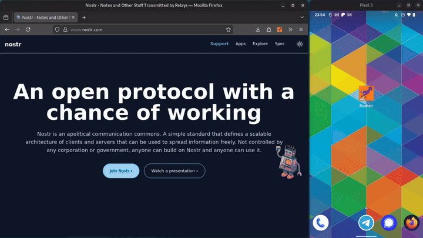
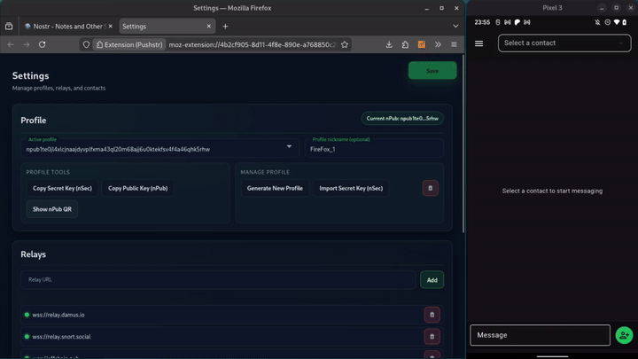
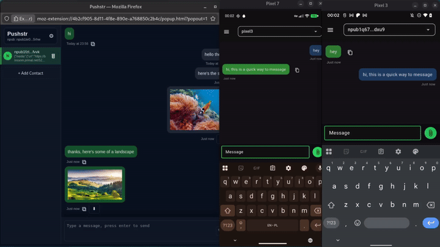
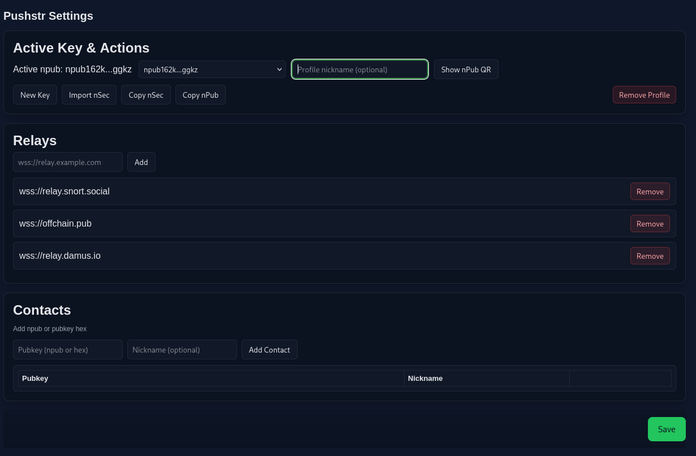
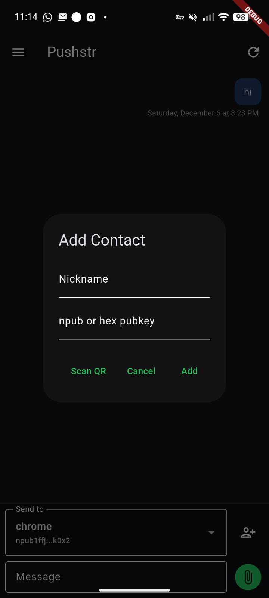
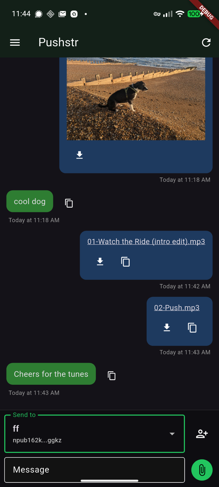

# Pushstr – Private, Secure, Instant Communication

> **Pushstr is a fast, lightweight communication layer built on Nostr.**  
> It is quick, secure, and anonymous if required — with no registration, no payment, and no central server.

Generate an address and start communicating within seconds. All user data are created and stored locally, and can be backed up or restored as needed. Add a contact to begin sending, or simply share your address to receive messages. A minimal messaging interface surfaces activity from your contacts in real time.

An address can be used for any duration and you may create unlimited parallel addresses to isolate conversations.  
All messages are encrypted for the recipient and then encrypted again during transport, protecting both parties end-to-end.

---

## Core Use Cases

### Simple chatting
- Private conversations with friends or fully anonymous interactions.
- Great for one-off contact: e.g., put a QR code on a poster to create a disposable inbound-only address.

### Notes and file sharing
- Install the browser extension and link it with your phone or another computer.
- Send text, images, or arbitrary data privately and securely.

### Secure, flexible file transfer
- From text and JPEGs to MP3 or ZIP archives.
- All files are encrypted for the recipient before transport.

### Plan-A communications
- Fast, lightweight stack enabling effortless, low-friction messaging.

### Plan-B communications
- Multi-relay, multiple-redundancy architecture for extremely high reliability and uptime.

### Ephemeral profiles
- Create as many profiles as there are stars in the sky without limitation*.  
- Each profile may be used once or forever, depending on your threat model.

> **\*** *There are approximately 10^53 times more possible Nostr keys than stars in the observable universe.*

---

## Communication Options

| Type           | Security | Privacy | Reliability | Stability / Redundancy |
|----------------|----------|---------|-------------|--------------------------|
| Legacy apps    | Low      | Low     | High        | Low – single-provider failure = total outage |
| Privacy apps   | Medium   | Medium  | Medium      | Low – centralised backend, Cloudflare-level outages |
| Nostr          | High     | High    | High        | High – distributed relays, no single point of failure |
| **Pushstr**    | **High** | **High** | **High**    | **Very High – multi-relay redundancy + client-side failover** |

---

# Demos
- First time open, show settings, add nickname


- open, show qr, add contact via qr, message


- extension popout, add photo, send to mobile, mobile attaches and sends a photo back


- extension popout, second phone, add mobile contact, message


- rename contact, switch contact, send message to extension


---

# "Pushbullet on Nostr"


Pushbullet-style messaging over Nostr Giftwrapped DMs. Runs as a Firefox/Chrome extension and as a mobile app (Android/iOS).

Quick, secure, private, anonymous multi-media messaging between devices to help improve productivity.

Android and Firefox are stable - Chrome and iOS function but are a little buggy.

## What it does
- Generates or imports a profile (`nsec`), wraps messages as NIP-17 giftwrap (`kind:1059` with inner `kind:4`), and sends through your relays.
- Listens for messages, decrypts locally and displays messages or download links for larger files.
- Browser extension UI for quick send + options; mobile app mirrors the flow with native share intent and chat view.
- Larger files encrypted for recipient and distributed via Blossom.

## Prereqs
- Node 18+, npm
- For browsers: Firefox or Chrome/Chromium
- For mobile: Flutter 3.10+, Android SDK; Xcode for iOS. Rust + `cargo-ndk` only if you want to rebuild the native library.

## Build & run
### Browser extension
```bash
npm install
# Firefox (MV2)
npm run package
# Chrome (MV3)
MANIFEST_FILE=manifest.chrome.json npm run package
```
- Output: `dist/` plus `pushstr.zip`. Load `dist/` as a temporary add-on (`about:debugging` in Firefox) or an unpacked extension (`chrome://extensions` in Chrome).

### Mobile app (Android/iOS)
```bash
cd mobile
flutter pub get
# Run on attached device/emulator (Android or iOS)
flutter run
# Android release APK
flutter build apk --release
# Load to connected mobile
flutter install --use-application-binary build/app/outputs/flutter-apk/app-release.apk
```
- Optional Rust rebuild (refresh FFI + native libs):
```bash
flutter_rust_bridge_codegen generate
cd pushstr_rust
cargo ndk -t arm64-v8a -t armeabi-v7a -o ../mobile/android/app/src/main/jniLibs build --release
```
See `mobile/QUICKSTART.md` for more detail.

## Notes
- No cloud backups. Export your `nsec` and keep it safe.
- Relay outages aren’t retried automatically; reload/refresh to reconnect.
- Vendored `vendor/nostr-tools.bundle.js`; bump there to update nostr-tools.

# Browser extension


# Mobile app




## Next Steps

1. Publish to Zapstore / mobile app stores
1. Distribute browser extensions
